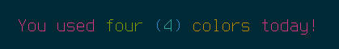

# Paintbrush

Simple and concise string colorization for _Ruby_ without overloading `String` methods or requiring verbose class/method invocation.

_Paintbrush_ has zero dependencies and does not pollute any namespaces or objects outside of the `#paintbrush` method wherever you include the `Paintbrush` module.

Nesting is supported, allowing you to use multiple colors within the same string. The previous color is automatically restored.

```ruby
include Paintbrush
puts paintbrush { purple "You used #{green 'four'} #{blue "(#{cyan '4'})"} #{yellow 'colors'} today!" }
```


## Installation

Add _Paintbrush_ to your `Gemfile`:

```ruby
gem 'paintbrush'
```

Build your bundle:

```ruby
bundle install
```

## Usage

Include the `Paintbrush` module anywhere and call `#paintbrush` to generate a colorized string. Nested strings are supported, allowing many complex combinations to be written in a single line.

`#paintbrush` receives a block, within the block the following methods are available, each of which receives a string:

* `#black`
* `#red`
* `#green`
* `#yellow`
* `#blue`
* `#purple`
* `#cyan`
* `#white`
* `#default`

Hex colors are also available as `#hex_ff00ff` and `#hex_f0f`, allowing a much wider range of colors.

Use [string interpolation](https://docs.ruby-lang.org/en/3.2/syntax/literals_rdoc.html#label-String+Literals) to nest multiple colors:

```ruby
include Paintbrush
puts paintbrush { green "some green text, #{yellow "some yellow text"} and some green again" }
puts paintbrush { hex_ff00ff "some magenta #{hex_ffff00 "and some yellow"} and magenta again" }
```

## Alternatives

* [Colorize](https://github.com/fazibear/colorize)
* [Rainbow](https://github.com/sickill/rainbow)
* [Paint](https://github.com/janlelis/paint)

And [many others](https://www.ruby-toolbox.com/search?display=compact&order=score&q=string%20color&show_forks=false).

## Motivation

There are plenty of gems that solve this problem in various ways but I was unable to find one that achieves all of the following:

* Support for nested strings.
* No pollution of _Ruby_ `String` objects.
* Concise syntax allowing strings to be generated in-line.

This gem is an attempt to achieve all of the above. If it's not for you, take a look at one of the alternatives (see above).

## Development

Make a pull request to fix a bug or add a feature.

Run `make test` to verify all tests and lint checks have passed.

## License

_Paintbrush_ is released under the [MIT License](https://opensource.org/license/mit/).
